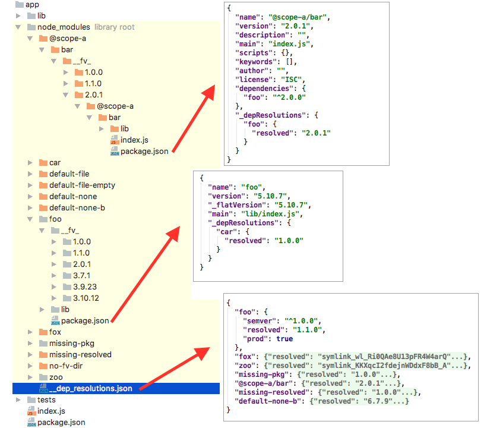

# node-flat-module

#### Flat module dependencies system for NodeJS

This is an implementation of a flat module dependencies system for NodeJS.

# Motivation

NodeJS's nested `node_modules` is simple and autonomous. No matter where you are, your require will find the nearest `node_modules` that contains the module you want. It's elegant and simple, but doesn't come cheap.

The cost is duplicate modules, complexity of which is shifted to package managers, and it's a hard problem for them with no deterministic or perfect solution. NPM didn't offer a package hoisting solution to flatten duplicated modules until version 3. Even with the best hoisting, there's still bound to be duplications.

Node's module system also ignores any dependencies information and leaves that only to the package managers.

These lead to issues with deterministic module install and mixed up dependencies.

In my experience of using Node, these have been a constant source of problems in development, testing, and production.

Trying to keep deterministic `node_modules` has always been tricky. NPM's shrinkwrap has been buggy and generally complicated and a clunky chore to maintain and update.

When there are some modules that are best if they are not duplicated, managing that is not easy, and edge case issues occur during run time.

During development, developers constantly changes dependencies, and lead to completely unusable `node_modules` that requires full fresh installs. I've help resolved countless mysterious issues developers faced by having them reinstall everything.

Developing with `npm link`ing a module is generally a hit or miss thing. There are so many times that I had spent a lot of time helping someone debug an issue only to find out that they are doing `npm link`, which ends up being the cause of the issue.

So instead of trying to write the best Node Package Manager with the most optimal hoisting and flattening, and locking algorithms, another approach is to address the root of the complexity, Node's `node_modules` system.

# Design Overview

* No nested `node_modules`. Only one `node_modules`.
  * All modules are installed at the top level under `node_modules`. Extra nested versions are installed under a directory `node_modules/__fv_/<version>/<module_name>`. Therefore, one instance of each version of any module.
    * For example, `lodash` v4 is installed at `node_modules/lodash` but a nested v3.0.0 would be in `node_modules/__fv_/3.0.0/lodash`.
* Dependencies information is retained and checked at run time.
  * The file `package.json` will be significant for dependencies version resolution at run time.
  * When package manager installs a module, it inserts a section `_depResolutions` into `package.json`.
  * For the application, a file `__fyn_resolutions__.json` will be saved to its `node_modules` directory.
  * You can explicitly specify a version in code when calling `require`
    * ie: `require("foo@3")` or `require("foo@3.5.x/lib/blah")`
  * In a section `extraDependencies` in package.json, you can use an array of multiple semvers for a dependency.
    * In case you have a lib that uses xyz but can work with multiple versions of xyz and you want to have tests for each one.
    * Mainly something for package manager to implement.
    * The first one in the array would be the default resolution.
* Internally aware of linked modules to make `npm link` a more robust approach to module development.
  * Linked module will have a `node_modules` directory, within which is a `__fyn_link__.json` that contains the linking and dependencies resolution info.
  * Dependencies for the linked module will be solely resolved from the application's `node_modules`.
* Will fallback to original module system if no dependencies resolution information found.

## A Sample

Here is how an application's `node_modules` might look like. Captured from this module's test fixtures.

